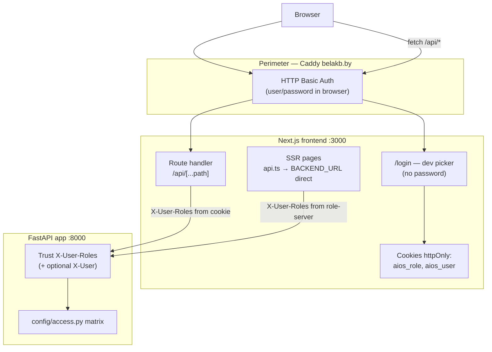

# Frontend OIDC readiness — Track B inventory (2026-07-16)

> **Repo:** `Сlaude CRM - проект/frontend`  
> **Scope:** inventory + ADR + minimal non-breaking proxy patch.  
> **Explicitly NOT done:** backend `AIOS_AUTH_MODE=oidc`, Keycloak login UI, server/Caddy changes, push.

---

## 1. Current auth flow

### Layers (production today)



### Step-by-step (dev / current prod)

| Step | Where | What happens |
|------|-------|--------------|
| 1 | Caddy | Browser must pass **HTTP Basic Auth** to reach belakb.by (perimeter only; unrelated to app RBAC). Telephony/SSE paths bypass Basic Auth per `coordination/caddy-telephony-snippet.md`. |
| 2 | `/login` | User picks employee from backend `/system/users`; **no password**. POST `/api/auth/login` sets httpOnly cookies `aios_role` + `aios_user` (1 year). |
| 3 | App gate | `AppShell` (`src/components/app-shell.tsx`) redirects to `/login` if `aios_user` cookie missing. |
| 4 | Client API | Browser `fetch("/api/...")` → Next route `src/app/api/[...path]/route.ts` → FastAPI with **`X-User-Roles`** from `aios_role`. |
| 5 | SSR API | Server components call `BACKEND_URL` **directly** (bypass proxy), pass **`X-User-Roles`** via local `roleHeaders()` + `currentRole()` from `role-server.ts`. |
| 6 | Backend | `auth_mode=dev`: reads `X-User-Roles` / `X-User`; **ignores Bearer**. `auth_mode=oidc`: reads **Bearer JWT only**; invalid/missing → Guest (403 on protected routes). |
| 7 | Logout | POST `/api/auth/logout` deletes cookies; sidebar → `/login`. |

### Key files (auth-related)

| File | Role |
|------|------|
| `frontend/src/app/login/page.tsx` | Dev login UI (Keycloak noted as «часть 5») |
| `frontend/src/app/api/auth/login/route.ts` | Sets `aios_role` / `aios_user` |
| `frontend/src/app/api/auth/logout/route.ts` | Clears session cookies |
| `frontend/src/app/api/[...path]/route.ts` | **Main API proxy** → backend |
| `frontend/src/lib/access.ts` | Cookie names, `fetchAccess`, user list |
| `frontend/src/lib/role-server.ts` | SSR cookie readers (server-only) |
| `frontend/src/components/app-shell.tsx` | Login gate |
| `frontend/src/components/sidebar.tsx` | Logout button |
| `frontend/e2e/auth.setup.ts` | Playwright dev-login fixture |
| `core/services/auth.py` | Backend dev vs oidc (reference only) |

### `X-User-Roles` usage map

**Central proxy:** `app/api/[...path]/route.ts` — injects role for all client `/api/*` calls.

**SSR direct fetches** (duplicate local `roleHeaders()` — same pattern):

- `src/lib/api.ts`
- `src/lib/reference-data.ts`
- `src/lib/wms-{warehouse,stock,ops,inventory}.ts`
- `src/lib/production-{zayavki,vyrabotka,plan,otk,norms,bom,analytics}.ts`
- `src/lib/procurement-{suppliers,machine,claims,rfq,orders}.ts`
- `src/lib/access.ts` (`fetchAccess`)
- `src/components/deal-client-360.tsx` (inline header)

**No** `Authorization`, `Bearer`, Keycloak SDK, or OIDC callback routes anywhere in frontend today.

---

## 2. Exact files to change for Bearer forwarding (full OIDC path)

### Already patched (this Track B — safe skeleton)

| File | Change |
|------|--------|
| `frontend/src/lib/api-proxy-headers.ts` | **NEW** — `buildBackendProxyHeaders()`: forward `Authorization`, optional Bearer from token cookie |
| `frontend/src/lib/api-proxy-headers.test.ts` | **NEW** — unit tests (3 cases) |
| `frontend/src/app/api/[...path]/route.ts` | Uses helper; reads future `TOKEN_COOKIE` |
| `frontend/src/lib/access.ts` | `TOKEN_COOKIE = "aios_access_token"` reserved (not set yet) |

### Still required before backend oidc flip

| Priority | File(s) | Work |
|----------|---------|------|
| P0 | `frontend/src/app/api/auth/login/route.ts` **or** new `api/auth/oidc/callback/route.ts` | Exchange Keycloak code → set httpOnly `aios_access_token` (+ refresh handling) |
| P0 | `frontend/src/app/login/page.tsx` | Replace dev picker with Keycloak redirect (keep dev path behind env flag) |
| P0 | `frontend/src/lib/role-server.ts` | SSR: stop relying on `aios_role` alone when oidc; read token cookie or session |
| P0 | `frontend/src/lib/api.ts` + 14 domain `*.ts` libs | SSR fetches: add Bearer (shared helper, **do not** bloat `api.ts` — extract `auth-headers-server.ts`) |
| P0 | `frontend/src/lib/access.ts` | `fetchAccess()` must send Bearer in oidc mode |
| P1 | `frontend/src/components/app-shell.tsx` | Gate on valid session/token, not only `aios_user` |
| P1 | `frontend/e2e/auth.setup.ts` | OIDC or service-account path for CI |
| P1 | `frontend/.env.local` (untracked) | `NEXT_PUBLIC_KEYCLOAK_*` issuer, client_id, redirect_uri |
| P2 | `frontend/CLAUDE.md` | Document dual auth mode |

**Backend contract (no frontend change):** `auth_mode=oidc` expects `Authorization: Bearer <JWT>` with `iss`/`aud`/`realm_access.roles` — see `core/services/auth.py`.

---

## 3. Recommended plans

### Plan A — Minimal patch (2–4 h) — **Bearer-ready proxy + SSR helper stub**

Goal: unblock Track D flip once Keycloak hostname stable; **keep dev/header-trust working**.

1. ✅ Proxy forwards `Authorization` + injects Bearer from `TOKEN_COOKIE` when present (`api-proxy-headers.ts`).
2. Add `frontend/src/lib/auth-headers-server.ts`:
   - `async function backendAuthHeaders(): Promise<Record<string, string>>`
   - oidc: `Authorization` from `TOKEN_COOKIE`; dev: `X-User-Roles` from `currentRole()`
   - Flag: `process.env.AIOS_AUTH_MODE ?? "dev"` (server-only env at build/runtime)
3. Wire **one** SSR path as proof (e.g. `fetchAccess` in `access.ts`) — rest follow same pattern.
4. Dev login unchanged; `TOKEN_COOKIE` unset → zero behavior change.

**Exit criteria:** manual test with `curl -H "Authorization: Bearer <valid-jwt>" /api/system/access` through Next proxy returns 200 when backend temporarily in oidc (staging only).

### Plan B — Full Keycloak login UI (1–2 d)

1. Public Keycloak client (or BFF confidential client in Next API routes).
2. Login page → redirect to Keycloak → callback route sets httpOnly tokens.
3. Token refresh (silent / refresh_token cookie).
4. Map Keycloak `realm_access.roles` ↔ UI module slugs (may differ from dev role slugs — align with realm roles already created: `director`).
5. Feature flag `NEXT_PUBLIC_AUTH_MODE=dev|oidc` for parallel dev/prod UX.
6. Update all SSR libs to use shared auth headers helper.
7. E2E: Keycloak test user or mock token injection.

**Exit criteria:** UI works with backend `AIOS_AUTH_MODE=oidc` without Caddy `X-User-Roles` curl hacks.

---

## 4. Can a small PR skeleton ship NOW without breaking header-trust?

**Yes.**

| Concern | Answer |
|---------|--------|
| Dev mode backend | Still uses `X-User-Roles`; extra Bearer header is **ignored** (`auth.py` dev branch). |
| Cookie login | Unchanged; `TOKEN_COOKIE` never set → no Bearer injected. |
| Caddy Basic Auth | Unaffected (outer HTTP layer; frontend still behind it). |
| Client fetches | Still no Authorization from browser — same as before. |
| Tests | `api-proxy-headers.test.ts` passes (3/3). |

**Risk:** none identified for current prod (`auth_mode=dev`). Do **not** flip backend to oidc until Plan A step 2–3 or Plan B completes.

---

## 5. Patch applied in this session (frontend only)

**Note:** Extracted proxy header logic to avoid editing monolithic `api.ts`. Behavior in dev mode is identical; adds explicit Authorization pass-through and a hook for future `aios_access_token` cookie.

```
frontend/src/lib/api-proxy-headers.ts       (new)
frontend/src/lib/api-proxy-headers.test.ts  (new)
frontend/src/lib/access.ts                  (+ TOKEN_COOKIE)
frontend/src/app/api/[...path]/route.ts     (uses buildBackendProxyHeaders)
```

No push. No server changes.

---

## 6. Caddy Basic Auth vs app credentials (summary)

| Mechanism | Purpose | Used by frontend? |
|-----------|---------|-------------------|
| Caddy `basicauth` on belakb.by | Site-wide perimeter (shared user/password) | Browser prompts once; independent of ERP login |
| `aios_role` / `aios_user` cookies | Dev identity + RBAC role for backend | Yes — sole app auth today |
| `X-User-Roles` header | Backend RBAC in dev mode | Set by proxy (client) or SSR libs (server) |
| Keycloak JWT / Bearer | Real AuthN in oidc mode | **Not wired** — backend ready, frontend not |

Caddy telephony bypass: `/integrations/telephony/*` and SSE `/sales/calls/stream*` skip Basic Auth (`coordination/caddy-telephony-snippet.md`). Frontend SSE uses relative `/api/sales/calls/stream` → Next proxy → backend (Basic Auth applies to Next, not directly to backend from browser).

---

## 7. Cross-track dependencies

| Track | Blocker for oidc flip |
|-------|----------------------|
| A | Stable `PUBLIC_KC_HOST` / `KC_HOSTNAME` |
| **B (this doc)** | Bearer on all API paths + login |
| D | `.env` prod + `AIOS_AUTH_MODE=oidc` only after A+B green |

See also: `coordination/orchestrator-answers/secure-env-flip-checklist-2026-07-16.md`, `coordination/secure-env-prep.md`.

---

## 8. Suggested next PR (operator)

**Title:** `feat(frontend): OIDC-ready API proxy headers (non-breaking)`

**Contains:** files listed in §5 only.

**Follow-up PR:** `auth-headers-server.ts` + `fetchAccess` wiring + env flag (Plan A remainder).
