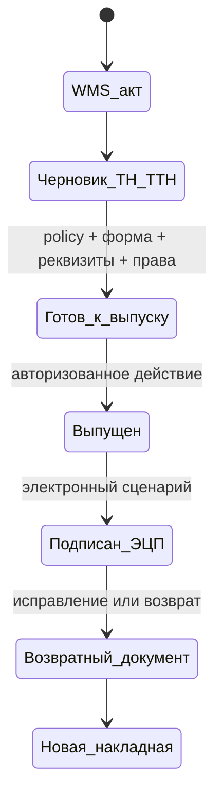

# ТН/ТТН: граница готовности и контракт внедрения

Статус: **проектная спецификация, не нормативная сертификация**.
Проверено по официальным источникам: 21 сентября 2026 года.

Этот документ описывает, что ERP должна проверять до выпуска ТН/ТТН и электронной накладной. Он не добавляет форму, номер, ставку, реквизиты организации, ЭЦП или внешний обмен. Такие значения должны быть заданы для конкретного юрлица и периода уполномоченным бухгалтером.

## Подтверждённая нормативная граница

1. Хозяйственная операция оформляется первичным учётным документом при совершении операции или непосредственно после неё. Официальное разъяснение МНС также указывает, что ТТН-1 и ТН-2 применяются для списания ТМЦ у грузоотправителя и (или) принятия к учёту у грузополучателя. [МНС: прослеживаемость товаров](https://nalog.gov.by/question-answer/trackability/)
2. Для части операций с прослеживаемыми товарами требуется электронная накладная. Нельзя переносить это правило на все товары без проверки номенклатуры, даты и режима конкретного юрлица. [МНС: электронные накладные](https://nalog.gov.by/tax_control/transport_documents/el_transport_documents/)
3. Официальное разъяснение МНС указывает: подписанные ЭЦП электронные накладные не отменяются и не корректируются; для исправления используется связанная возвратная и новая накладная, с номером первоначальной в дополнительных полях и фактической датой хозяйственной операции. [МНС: разъяснение по прослеживаемости](https://nalog.gov.by/question-answer/trackability/)
4. Отдельные товарные категории получают новые обязательные режимы. Например, с 1 мая 2026 года МНС описывает обязательные электронные накладные для части маркированных напитков и соков. Это пример периодной и товарной применимости, а не настройка по умолчанию для всего каталога. [МНС: новости от 13.04.2026](https://nalog.gov.by/news/34920/)

## Что уже есть в ERP

`PhysicalShipmentAct` и его immutable source key фиксируют внутреннюю физическую отгрузку, версию счёта, digest резерва и строки движения. В реестре сделки можно открыть этот акт и запросить `ShipmentDocumentDraft`.

Черновик намеренно возвращает `status=draft_required`, `statutory_certified=false` и `can_issue=false`. Он заполняет только доказанные из WMS дату операции, количество и строки номенклатуры. Он не является ТН, ТТН или электронной накладной.

Версия `Policy` поддерживает необязательное поле `shipment_documents` со сценариями `tn` и/или `ttn`. Каждый сценарий требует явные `exchange_mode`, `form_version`, `numbering_rule`, `signing_rule`, `exchange_rule` и `evidence`; данные не получают значений по умолчанию. По дате физической операции черновик выбирает только применимую версию политики и показывает один из статусов: нет политики, нет сценария выбранного вида, неполная настройка, неподтверждённая нормативная база или `review_ready`. Даже `review_ready` не меняет `can_issue=false` и не создаёт номер, ЭЦП или внешнюю отправку.

## Обязательный контракт перед выпуском

Для каждого юрлица и периода, где применима ТН/ТТН, должна существовать отдельная, версионируемая запись политики отгрузочных документов. До её заполнения система может показывать только черновик с явным блокером.

| Поле политики | Требование к ERP |
| --- | --- |
| Юрлицо и период действия | Выбор обязателен; прошлые выпуски сохраняют ссылку на использованную версию. |
| Вид документа | Явный выбор ТН, ТТН или применимого электронного сценария. Никакого автоматического выбора по названию товара. |
| Основание применимости | Ссылка на проверенный источник и решение бухгалтера по виду товара, маршруту и контрагенту. |
| Форма и версия формата | Идентификатор формы/формата и дата проверки. Отсутствие блокирует финальный выпуск. |
| Нумерация | Отдельный источник серии/номера с защитой от повторного выпуска. |
| Подписанты и обмен | Роли ответственных лиц, способ ЭЦП/провайдера, статус передачи и приёма. Без авторизованного действия наружу документ остаётся подготовленным. |
| Связь с операцией | `PhysicalShipmentAct`/его digest, счёт, сделка, склад, дата фактической операции и строки. Ручная подмена этих источников запрещена. |

## Состояния и исправления

- Внутренний WMS-акт нельзя переименовать в ТН/ТТН.
- Отмена CRM-счёта не должна отменять уже подписанную электронную накладную.
- Для электронной накладной после ЭЦП должен использоваться связанный возвратный/новый документ, а не update/delete исходной записи.
- ERP хранит исходный номер, связь корректировки и дату фактической операции отдельно от времени регистрации.

## Минимальная приёмка локального policy-среза и будущего выпуска

1. Бухгалтер создаёт policy без предустановленной формы и без тестовых реквизитов либо сохраняет один или два полностью заполненных сценария.
2. Из подтверждённого WMS-акта строится черновик; без policy, сценария выбранного вида или нормативной проверки он показывает блокер. При полном сценарии черновик связывает policy с датой операции, но не предлагает выпуск.
3. Будущий контур выпуска должен связать один выпуск с неизменяемым WMS-актом и версией policy; повтор с тем же request key не создаёт второй номер.
4. Подписанная электронная накладная не редактируется и не отменяется API-командой; будущий тест доказывает только создание связанного корректирующего/возвратного документа.
5. Будущий реестр сделки показывает WMS-акт, подготовленный документ, внешний идентификатор/статус и цепочку корректировки. Внешняя отправка выполняется только уполномоченным пользователем после отдельной проверки.

## Внешние входы, без которых выпуск не начинается

- учётная политика и перечень применимых видов ТН/ТТН по каждому юрлицу;
- подтверждённые формы/форматы, серии и нумерация;
- правила маршрута, перевозчика и подписантов;
- применимость прослеживаемости, маркировки, GTIN/GLN и интеграции электронного обмена;
- доступы и договор с провайдером, если выбран электронный сценарий.

До получения этих входов этот документ ограничивает дизайн и не является разрешением на юридический выпуск или внешнюю отправку.
